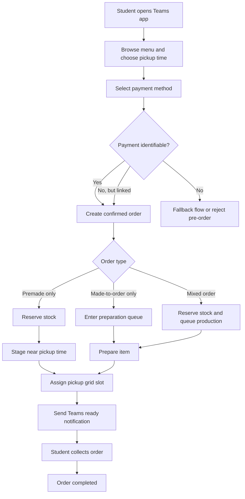

# Coffee Shop Ordering in Microsoft Teams

## High-Level Design Proposal

## 1. Executive Summary

This proposal outlines a school coffee and snack ordering service delivered through Microsoft Teams. The aim is to reduce break-time queues by letting students place and pay for orders in advance on devices they already carry, then collect those orders from a numbered pickup grid once ready.

The recommended approach is intentionally conservative:

- Reuse Microsoft Teams as the front door instead of introducing another student app.
- Reuse the school's existing payment system instead of replacing it.
- Start with a supervised numbered pickup grid or cubby wall rather than expensive smart-locker hardware.
- Optimize first for the real operational split between premade items and made-to-order items.

The proposal is feasible if it is treated as an operations improvement as much as a digital product. The app can remove queueing at the till, but it must also control kitchen load, reserve stock accurately, and make pickup simple enough that staff are not just trading one queue for another.

## 2. Problem Statement

Students have limited break time. The current queue-based process forces them to spend a large portion of that break waiting to order, pay, and collect coffee or snacks. This creates four direct problems:

- Lost student time during short breaks.
- Uneven rushes that overload staff at specific times.
- Missed sales when students give up because the line is too long.
- A poor experience even when the items themselves are simple to prepare.

The core design goal is therefore not just "mobile ordering". It is a faster end-to-end service model that reduces physical queueing while staying realistic for a school environment.

## 3. Design Principles

- Cost-effective: prefer software and process changes over new hardware and major infrastructure.
- Reuse the existing stack: fit into Teams and the current payment environment instead of creating a parallel ecosystem.
- Operationally realistic: the service must work for staff during break-time peaks, not only in demos.
- Identity-aware: each order must be traceable to a student or an approved guest flow.
- Queue-reducing: the design should remove waiting at ordering time and minimize waiting at pickup time.
- Expandable: the same service pattern should later support lunch ordering.

## 4. Current Constraints and Assumptions

### Known Constraints

- All students already have access to Microsoft Teams on their devices.
- The school already has a digital payment system.
- Student card payments identify the student.
- WeChat payments do not currently identify the student.
- There are two broad item types:
  - Premade items: stocked in advance and reserved when ordered.
  - Made-to-order items: prepared after the order is placed.
- The school wants both a student view and an admin view.

### Working Assumptions

- The school has one coffee provider and one small service point, roughly 50 square metres.
- The coffee point is usually staffed by one to two workers.
- Fewer than 500 pupils are eligible to use the shop during break at the upper bound, but typical traffic is usually under 50 pupils.
- The app will primarily be used as a personal Teams app, so each student sees their own orders and status.
- Staff will continue to prepare items using existing shop workflows rather than a completely new operating model.
- Pickup will happen from a staffed collection area using numbered slots, shelves, or cubbies.
- Students may order well before collection time, for example in the morning for early, mid, or late break pickup.

These assumptions matter because they point toward a lightweight operational tool, not a large dining platform. The design should help one small team work more smoothly during short peaks.

## 5. Proposed Service Model

### In One Sentence

Students order and pay inside Teams, the shop prepares the order using capacity-aware rules, the system assigns a pickup grid location when the order is ready, and the student collects with minimal counter interaction.

### Pickup Window Model

Pickup time selection should be built into the service from the start. A student should be able to order ahead for a defined collection window such as:

- early break
- mid break
- late break
- lunch, in a future extension

This matters for two reasons:

- it makes the service useful before peak time actually starts
- it gives the shop a practical way to spread preparation work across the day

The recommended model is:

- let students choose from a short list of school-defined pickup windows
- show whether each window is open, filling up, or full
- stop accepting orders into a window once the shop reaches safe preparation capacity

That approach is simpler and more realistic than allowing any arbitrary minute selection.

### Why Teams Is a Good Fit

- It is already installed and used daily.
- The school does not need to persuade students to adopt another app.
- Teams identity can support a smoother sign-in experience.
- Teams notifications and deep links can bring students back into the order screen quickly.

## 6. Operating Model Overview

## 7. User Views

### Student View

The student view should be simple and task-focused:

- Menu by category: coffee, snacks, cold drinks, quick grab items.
- Clear labels for:
  - available now
  - limited stock
  - made fresh
  - sold out
- Pickup window selection before checkout, with clear options such as early, mid, or late break.
- Pickup time estimate within the selected window.
- Payment selection.
- Order tracking screen.
- "Ready for pickup" message with order number and grid location.
- Recent orders and reorder shortcut for common purchases.

### Staff/Admin View

Because this is a single small coffee point, the operational side can stay simple. A shared staff/admin screen is likely enough for launch.

It should cover:

- Live order queue.
- Filters by status and pickup window.
- Clear separation of premade reservations and made-to-order work.
- Configuration of pickup windows and order caps.
- Payment exceptions and pay-at-collect handling.
- Inventory and availability controls.
- Pickup grid management.
- Simple status changes such as accepted, preparing, ready, and collected.

## 8. Fulfillment Logic

### 8.1 Item Classes

The system should treat two item classes differently.

| Item class | Typical examples | Operational rule | Main risk |
| --- | --- | --- | --- |
| Premade | bottled drinks, packaged snacks, pastries already prepared | Reserve stock immediately, stage close to pickup time | overselling or holding too early |
| Made-to-order | coffee, toasties, hot snacks | Queue against preparation capacity | backlog during break peaks |

### 8.2 Mixed Orders

Mixed orders are the critical design case. If a student orders both a premade snack and a fresh drink, the system should not release the premade item too early if that reduces quality or clutters the pickup area.

Recommended rule:

- Reserve premade stock at order time.
- Delay physical staging of premade items until the made-to-order component is close to completion.
- Present one pickup moment to the student wherever possible.

### 8.3 Capacity Control

Mobile ordering does not remove demand spikes; it shifts them. To stay feasible, the app should use lightweight capacity control:

- Limit the number of made-to-order items accepted per pickup window.
- Show later pickup estimates when the queue is busy.
- Let students select from predefined pickup windows rather than unrestricted times.
- Allow staff to pause selected items during peaks.
- Keep the launch menu narrow enough that fulfillment stays predictable.

In practice, this can be much simpler than a large-scale system. For one counter with one to two staff, fixed order caps per break window may be enough. A student could place an order in the morning and choose a later collection window such as early, mid, or late break. The system should then hold that order in the right queue so preparation happens close enough to pickup to preserve quality.

### 8.4 Optional Improvement: Load Distribution

Once the core ordering flow is working reliably, the school could add a simple load-distribution feature to reduce crowding at the busiest moments.

This would have two student-facing parts:

- a live or near-live shop busyness indicator, such as quiet, moderate, busy, or peak
- suggested pickup times that steer students toward less crowded windows

This would also have one system-facing part:

- optional assignment of pickup windows based on current queue length, fresh-item capacity, and available pickup-grid space

The idea is not to remove student choice entirely. A better approach is:

- offer the earliest available pickup time
- show one or two quieter alternatives
- optionally make peak windows unavailable once they are full

This can help in two ways:

- students can make a quick decision about whether to order now or wait for a calmer period
- the system can spread demand more evenly instead of allowing everyone to target the same break-minute

Recommended position:

- keep this out of the first pilot if simplicity is the main goal
- treat it as an optional phase 2 optimization once real demand patterns are known

### 8.5 Practical Order Handling

For this scale of operation, the order-handling rule can stay simple:

- reserve premade stock when the order is accepted
- place fresh items into the correct pickup-window queue
- prepare fresh items close enough to the selected window to preserve quality
- assign a pickup grid slot only when the full order is ready

## 9. Payment and Identity Design

This is the most important real-world feasibility issue in the proposal.

### 9.1 Recommended Principle

An order should only enter the fulfillment flow once both of these are true:

- Payment is confirmed.
- The order can be linked to the correct student record or an approved exception flow.

### 9.2 Student Card Payments

Student card payment is the strongest fit for phase 1 because it already identifies the student. That makes it suitable for:

- reliable order ownership
- easier dispute handling
- pickup verification
- cleaner reporting

### 9.3 WeChat Payments

WeChat is convenient, but your current constraint is that it does not identify the student. That creates several risks:

- staff cannot confidently match payment to person
- refunds and disputes become harder
- wrong-order collection becomes more likely
- pickup without identity may invite misuse

### 9.4 Recommended Policy

For launch, the safest and simplest policy is:

- allow full pre-order and pickup for identifiable payment methods first
- treat anonymous WeChat payment as phase 2 unless an account-linking method is available
- default cash and other non-identifiable payment methods to order first and pay at collection

Possible phase 2 options:

- one-time WeChat-to-student account linking
- direct payment inside Teams so the order stays attached to the signed-in student context
- QR-based checkout that still ties back to the Teams identity
- pay-at-pickup for non-identifiable methods, if the school accepts that some queue remains

### 9.4.1 Cash and Other Pay-at-Collect Methods

If a student uses cash, or another payment method that cannot be reliably linked to identity, the default fallback should be:

- place the order in Teams first
- reserve stock or join the preparation queue
- assign a pickup time
- collect payment when the student arrives

This still improves service speed because the student avoids the full ordering conversation at the counter and staff can prepare the order before collection.

It does not remove all queueing, but it can still reduce congestion meaningfully.

### 9.4.2 Later-Step Option: Direct Payment in Teams

As a later enhancement, the school could offer direct payment inside the Teams app for non-identifiable digital methods.

The purpose would be to keep the payment flow attached to the signed-in Teams user, so the order can still be traced back to the correct student even when the underlying payment rail does not identify them clearly on its own.

This should be treated as a later phase because payment management is usually one of the more complicated parts of the service, especially around:

- reconciliation
- refunds
- payment failures
- audit expectations
- ownership of support issues

That makes it a strong future option, but not the simplest place to begin the pilot.

### 9.5 Payment Rules at a Glance

- Identifiable payment methods can go straight into the normal confirmed-order flow.
- Non-identifiable digital methods should be treated as later-phase options unless they can be linked to the signed-in student or completed directly inside Teams.
- Cash and similar methods can still use order-first, pay-at-collect so the student avoids the full ordering queue.

## 10. Pickup Grid Design

### 10.1 Physical Model

Each confirmed ready order is assigned to a numbered grid position. In the lowest-cost version, this is not a smart locker system. It is a supervised physical layout such as:

- numbered cubbies behind or beside the counter
- a shelf wall visible to staff
- a split hot/cold pickup zone if needed

This is more realistic for an initial school deployment than jumping straight to locker hardware.

### 10.2 Why This Matters

The grid solves three operational problems:

- staff have a clear final handoff location
- students do not need to ask "where is my order?"
- the app can give specific pickup instructions instead of a vague ready message

### 10.3 Recommended Rules

- Grid assignment happens only when the order is physically ready.
- Grid numbers should be short and easy to read.
- Orders should not remain long in pickup slots without escalation.
- Higher-risk items should stay in a supervised zone.

### 10.4 Collection Control Options

From cheapest to strongest:

1. Order number only.
2. Order number plus student name.
3. Short pickup code shown in Teams.
4. Pickup code plus staff spot-check against student ID.

Recommended launch position:

- use order number plus a short pickup code
- keep the pickup grid in a staff-supervised area

That gives a good balance between speed, cost, and misuse prevention.

## 11. Key Order States

For day-to-day operation, the order states can stay simple:

- Draft or awaiting payment.
- Confirmed.
- Preparing or queued for the selected pickup window.
- Ready for pickup.
- Collected.
- Cancelled or exception.

## 12. Real-World Feasibility Considerations

### 12.1 This Will Reduce Till Queues, Not Demand

The app removes the ordering queue, but the drinks still have to be made by one to two workers in a small space. If the service simply accepts unlimited orders, staff will face a digital queue that still causes long waits.

Mitigation:

- use simple order caps per pickup window
- show realistic ready times
- keep the launch menu focused

### 12.2 Break-Time Peaks Need Slotting

Typical traffic may be under 50 pupils, but demand will still bunch into a few short break windows. That is enough to overload a single counter if everyone chooses the same time.

Mitigation:

- use rolling pickup windows
- cap fresh-item throughput per pickup window
- encourage advance ordering before break starts
- optionally show a busyness indicator and steer orders into quieter windows

### 12.3 Open Pickup Can Create Theft or Confusion

If the grid is completely open and unsupervised, the wrong student may take the wrong order.

Mitigation:

- supervised pickup zone
- short pickup code
- exception desk for disputed orders

### 12.4 Inventory Accuracy Matters More Than In-Store Guesswork

In a walk-up model, staff can say "sorry, that is gone" at the till. In a pre-order model, stock errors are much more visible and frustrating.

Mitigation:

- start with a smaller digital menu
- use simple availability controls
- give staff the ability to mark items sold out instantly

### 12.5 Hot Drinks and Fresh Food Can Degrade Quickly

A coffee prepared too early is a bad product even if the app says it is efficient.

Mitigation:

- do not stage made-to-order drinks too early
- keep readiness tied to actual prep completion
- use short pickup windows and no-show rules

## 13. Risks and Mitigations

| Risk | Why it matters | Mitigation |
| --- | --- | --- |
| Anonymous WeChat payment | weak order ownership and harder dispute handling | launch with identifiable payment methods first; add account linking later |
| Pay-at-collect fallback still leaves some counter interaction | queue reduction is partial rather than complete | reserve this for cash and exceptional cases; keep collection fast and simple |
| Peak-time overload | digital orders can still exceed physical capacity | slotting, capped order windows, limited launch menu |
| Wrong order collected | undermines trust quickly | pickup code, supervised grid, clear labeling |
| Premade stock oversold | creates cancellations after payment | reserve stock at order confirmation |
| Quality drop for fresh items | students may stop using the service | prepare close to actual pickup time |
| Staff resistance | extra screens can feel like extra work | design the staff view around queue clarity and fewer interruptions |
| Partial outages | payment or app issues can block service | provide pause controls and a manual exception path |
| Too many customizations | slows production and raises errors | keep customization narrow in phase 1 |

## 14. Existing Solutions and Market Scan

There are already mature campus ordering products in the market. That matters mainly because it confirms the problem is real and that ordering, pickup, and campus-payment integration are all established patterns.

Examples include Grubhub Campus Dining, Transact mobile ordering, and CBORD campus commerce tools.

For this school, however, those platforms may be more than is needed. This is one small coffee point with one provider, one to two workers, and typical demand under 50 pupils in a break period. In that setting, a lighter Teams-first service may be a better fit because it:

- keeps students inside a tool they already use
- reuses the school's current payment environment
- avoids introducing a broader dining platform for a single service point
- stays closer to the actual operating model of one counter and a small staff team

The proposal is therefore strongest if positioned as a lightweight service layer over existing school systems, not as a full campus-commerce platform.

## 15. Recommended Rollout Plan

### Phase 1: Controlled Coffee and Snack Pilot

Scope:

- one coffee shop
- student view and one shared staff/admin view
- identifiable payment methods only
- narrow menu
- supervised pickup grid

Objectives:

- prove queue reduction
- prove operational feasibility at break time
- learn demand patterns

### Phase 2: Identity Expansion and Better Pickup Control

Scope additions:

- linked WeChat flow if feasible
- direct in-Teams payment for non-identifiable digital methods if payment governance is workable
- better notifications
- stronger pickup verification
- more reporting and stock controls
- optional load-distribution features such as busyness indicators and guided pickup windows

### Phase 3: Lunch Extension

Reuse the same service pattern:

- menu browsing
- capacity-aware ordering
- payment confirmation
- pickup time management
- staging and collection

Lunch will likely need:

- more item complexity
- stricter cutoff logic
- potentially a separate collection zone if demand is much higher

## 16. Success Measures

The pilot should be judged by operational outcomes, not just installs.

Suggested measures:

- average student wait time from arrival to collection
- number of students served during break
- percentage of orders collected on time
- number of failed or disputed pickups
- number of stock-related cancellations
- staff-reported ease of use
- repeat-order rate
- reduction in peak crowding if guided pickup windows are enabled

## 17. Recommended Final Position

The proposal is viable and well aligned with the school's stated principles, provided it launches as a focused operational improvement rather than a large platform build.

The strongest launch version is:

- Teams as the student front door
- existing school payment rails underneath
- student-card-led identity first, with pay-at-collect fallback for cash and similar methods
- simple, supervised pickup grid
- simple window-based capacity controls designed around one counter and one to two workers

The biggest design caution is payment identity. If anonymous WeChat payments are treated the same as identifiable student-card payments from day one, order ownership and pickup control may become unreliable. The proposal remains strong if that issue is handled explicitly instead of being deferred, either through pay-at-collect fallback or a later direct payment flow inside Teams.

## 18. Reference Notes

The following current sources informed this proposal and support its feasibility assumptions:

- Microsoft Learn: Teams tabs can be delivered as client-aware webpages inside Teams, which fits a personal app model.
- Microsoft Learn: Teams tab SSO supports using Teams identity to authenticate the signed-in user.
- Microsoft Learn: Teams activity feed notifications can bring users back into the app with deep links, which fits "ready for pickup" alerts.
- Grubhub Onsite: mobile ordering is used to reduce pickup wait times and integrate order flow into back-of-house operations.
- Grubhub Onsite: smart-locker pickup is an established pattern, which supports the proposed numbered-grid concept even if the school starts with a lower-cost manual version.
- Transact Campus / Hangry: higher education mobile ordering already includes campus card integration, pickup lockers, and school-branded ordering experiences.
- CBORD GET: campus mobile ordering already combines menu browsing, ordering, and campus payment in one student-facing flow.

## 19. Source Links

- Microsoft Teams basic tab apps: https://learn.microsoft.com/en-us/microsoftteams/platform/get-started/build-basic-tab-app
- Microsoft Teams tab SSO: https://learn.microsoft.com/en-us/microsoftteams/platform/tabs/how-to/authentication/tab-sso-overview
- Microsoft Teams activity feed notifications: https://learn.microsoft.com/en-us/microsoftteams/platform/tabs/send-activity-feed-notification
- Grubhub Onsite mobile ordering: https://onsite.grubhub.com/solutions/mobile-ordering/
- Grubhub Onsite smart lockers: https://onsite.grubhub.com/solutions/partnerships/smart-lockers/
- Grubhub Campus Dining: https://www.grubhub.com/about/campus
- Transact Mobile Ordering integration: https://www.transactcampus.com/solutions/campus-commerce/transact-mobile-ordering
- Transact Campus acquisition of Hangry: https://www.transactcampus.com/company/news-and-press/news-detail/2022/07/13/transact-campus-acquires-valued-partner-hangry-further-enhances-mobile-centric-campus-interaction-solutions
- CBORD GET overview sheet: https://resources.cbord.com/hubfs/Collateral/HE-Collateral/HE-GET-SellSheet.pdf
